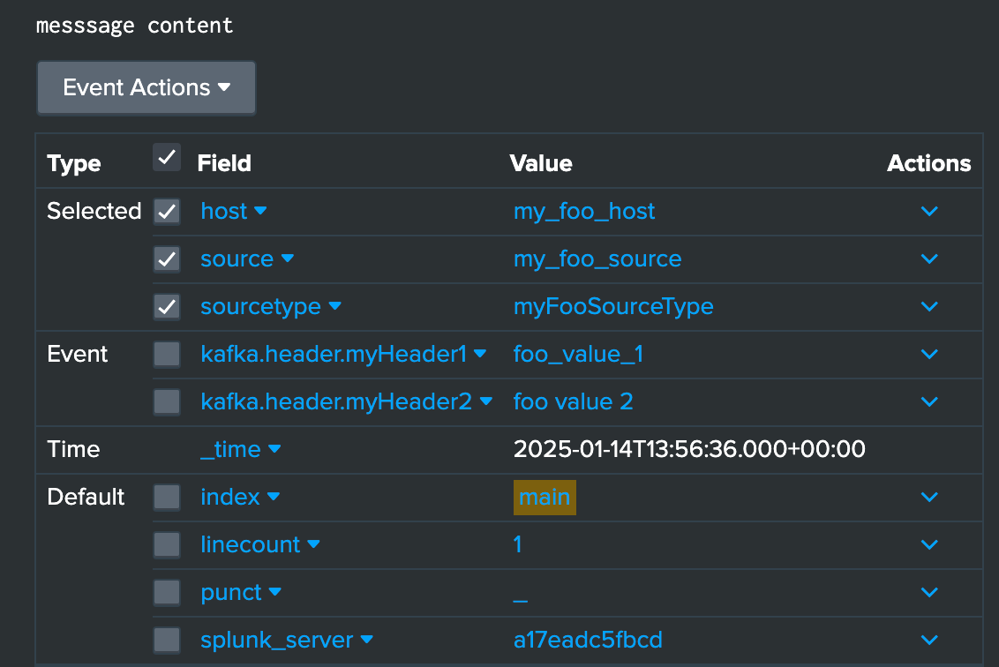
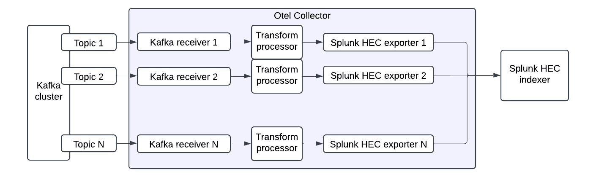

# Extract data from headers and timestamps

## Extract data from headers

The Collector for Kafka can extract data from Kafka message headers.

### Example configuration

```yaml
receivers:
  kafka:
    brokers: ["localhost:9092"]
    logs:
      topics: 
        - "example-topic"
      encoding: "text"
    header_extraction:
      extract_headers: true
      headers: ["index", "source", "sourcetype", "host","myHeader1", "myHeader2"]


exporters:
  splunk_hec:
    token: "your-splunk-hec-token"
    endpoint: "https://splunk-hec-endpoint:8088/services/collector"
    source: my-kafka
    sourcetype: kafka-otel
    index: kafka_otel
    splunk_app_name: "soc4kafka"
    sending_queue:
      enabled: true
      num_consumers: 10
      queue_size: 10000
      block_on_overflow: true
      sizer: items
      batch:
        min_size: 1000
    otel_attrs_to_hec_metadata:
      index: kafka.header.index
      host: kafka.header.host
      source: kafka.header.source
      sourcetype: kafka.header.sourcetype

service:
  pipelines:
    logs:
      receivers: [kafka]
      exporters: [splunk_hec]
```

In this configuration, the Kafka receiver lists the headers to extract. The receiver adds each extracted header as a log attribute in the format `kafka.header.<header_name>: <header_value>`.

Configure the Splunk HTTP Event Collector (HEC) exporter to map attribute keys to event metadata. The `kafka.header.index`, `kafka.header.host`, `kafka.header.source`, and `kafka.header.sourcetype` attributes update the event's `index`, `host`, `source`, and `sourcetype` metadata. The exporter does not add these values as separate log fields.

With this configuration, the collector sends `kafka.header.myHeader1` and `kafka.header.myHeader2` as log attributes. It sets the event's `host`, `source`, `sourcetype`, and `index` values from the corresponding headers.

### View the extracted headers in Splunk



## Extract timestamps

Use a transform processor to extract a timestamp from a log message.



For details, see the [transform processor documentation](https://github.com/open-telemetry/opentelemetry-collector-contrib/blob/main/processor/transformprocessor/README.md). The following example shows the minimum configuration for extracting timestamps:

```yaml
transform:
   error_mode: ignore
   log_statements:
     - set(log.attributes["extracted_ts"], ExtractPatterns(log.body, "<timestamp_regex>"))
     - set(log.time, Time(log.attributes["extracted_ts"]["timestamp"], "<format>", "<timezone>"))
     - delete_key(log.attributes, "extracted_ts")
```

The `set(log.attributes["extracted_ts"], ExtractPatterns(log.body, "<timestamp_regex>"))` statement captures the timestamp and stores it in the helper log attribute `"extracted_ts"`. The `<timestamp_regex>` value must be a valid regular expression with a named capture group called `timestamp`. For example: `\\[(?P<timestamp>[0-9]{4}-[0-9]{2}-[0-9]{2} [0-9]{2}:[0-9]{2}:[0-9]{2})\\]`.

The `set(log.time, Time(log.attributes["extracted_ts"]["timestamp"], "<format>", "<timezone>")` statement sets the log record's timestamp. The `<format>` value specifies a strptime-style timestamp format. The optional `<timezone>` value specifies a time zone name.

Finally, the `delete_key(log.attributes, "extracted_ts")` statement removes the helper log attribute `"extracted_ts"`.

The following example configures timestamp extraction:

```yaml
receivers:
  kafka:
    brokers: ["localhost:9092"]
    logs:
      topics:
        - "example-topic"
      encoding: "text"

processors:
  transform:
    error_mode: ignore
    log_statements:
      - set(log.attributes["extracted_ts"], ExtractPatterns(log.body, "\\[(?P<timestamp>[0-9]{4}-[0-9]{2}-[0-9]{2} [0-9]{2}:[0-9]{2}:[0-9]{2})\\]"))
      - set(log.time, Time(log.attributes["extracted_ts"]["timestamp"], "%Y-%m-%d %H:%M:%S", "UTC"))
      - delete_key(log.attributes, "extracted_ts")

exporters:
  splunk_hec:
    token: "your-splunk-hec-token"
    endpoint: "https://splunk-hec-endpoint:8088/services/collector"
    source: my-kafka
    sourcetype: kafka-otel
    index: kafka_otel
    splunk_app_name: "soc4kafka"
    sending_queue:
      enabled: true
      num_consumers: 10
      queue_size: 10000
      block_on_overflow: true
      sizer: items
      batch:
        min_size: 1000

service:
  pipelines:
    logs:
      receivers: [kafka]
      processors: [transform]
      exporters: [splunk_hec]
```
