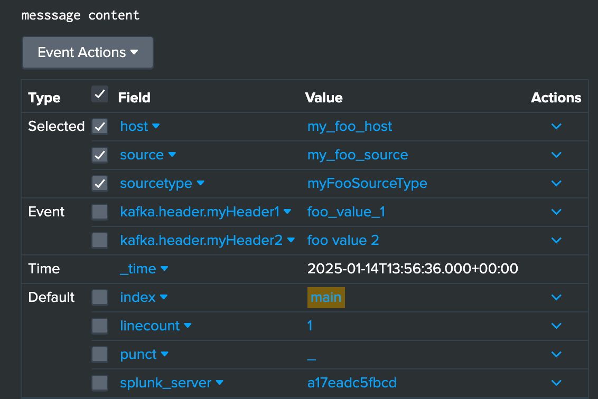
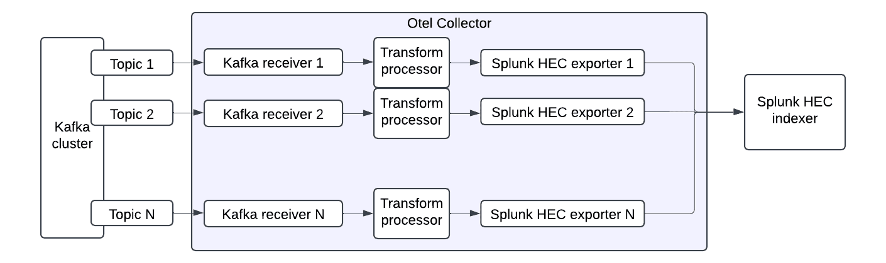

## Extracting additional data

### Headers

SOC4Kafka connector supports extracting data from headers.

#### Example configuration

```yaml
receivers:
 kafka:
   brokers: ["localhost:9092"]
   topic: "example-topic"
   encoding: "text"
   header_extraction:
     extract_headers: true
     headers: ["index", "source", "sourcetype", "host","myHeader1", "myHeader2"]

processors:
 batch:

exporters:
 splunk_hec:
   token: "your-splunk-hec-token"
   endpoint: "https://splunk-hec-endpoint:8088/services/collector"
   source: my-kafka
   sourcetype: kafka-otel
   index: kafka_otel
   otel_attrs_to_hec_metadata:
     index: kafka.header.index
     host: kafka.header.host
     source: kafka.header.source
     sourcetype: kafka.header.sourcetype

service:
 pipelines:
   logs:
     receivers: [kafka]
     processors: [batch]
     exporters: [splunk_hec]
```

In the configuration above, the Kafka receiver includes a list of header names to extract. The extracted headers will be added to the log attributes in the following format: `kafka.header.<header_name>: <header_value>`
Moreover, the Splunk HEC exporter allows configuring attribute keys that can modify the metadata of the log. In the example above, the following attributes: `kafka.header.index`, `kafka.header.host`, `kafka.header.source` and `kafka.header.sourcetype` will not be added to the log as separate fields. Instead, they will update the `index`, `host`, `source` and `sourcetype` attributes of the event sent to Splunk.
Using headers configuration like the one shown above, we can ingest the following message into Splunk, with `kafka.header.myHeader1` and `kafka.header.myHeader2` attached to the log attributes. The `host`, `source`, `sourcetype` and index are set using corresponding headers. 

#### How it looks in Splunk



### Timestamps

To extract the timestamp from a log message, we can use a transform processor. 



The full documentation for the processor can be found at [this link](https://github.com/open-telemetry/opentelemetry-collector-contrib/blob/main/processor/transformprocessor/README.md). However, we only need a subset of its functionalities, Below is the minimal configuration required for timestamp extraction using the transform processor:

```yaml
transform:
   error_mode: ignore
   log_statements:
     - set(log.attributes["extracted_ts"], ExtractPatterns(log.body, "<timestamp_tegex>"))
     - set(log.time, Time(log.attributes["extracted_ts"]["timestamp"], "<format>", "<timezone>"))
     - delete_key(log.attributes, "extracted_ts")
```

The `set(log.attributes["extracted_ts"], ExtractPatterns(log.body, "<timestamp_regex>"))` statement captures the timestamp and sets a helper log attribute `"extracted_ts"`. The `<timestamp_regex>` must be a valid regex containing a named capturing group timestamp. An example of such a regex is: `\\[(?P<timestamp>[0-9]{4}-[0-9]{2}-[0-9]{2} [0-9]{2}:[0-9]{2}:[0-9]{2})\\]`.

The `set(log.time, Time(log.attributes["extracted_ts"]["timestamp"], "<format>", "<timezone>")` statement sets the actual timestamp of the log. It converts the extracted timestamp into a `Golang time.Time object`. The `<format>` variable specifies the standard Go layout format and `<timezone>` is an optional variable that specifies a timezone name. 
Finally, the `delete_key(log.attributes, "extracted_ts")` statement removes the helper log attribute `"extracted_ts"`.

Timestamp extraction configuration: 

```yaml
receivers:
  kafka:
    brokers: ["localhost:9092"]
    topic: "example-topic"
    encoding: "text"

processors:
  transform:
    error_mode: ignore
    log_statements:
      - set(log.attributes["extracted_ts"], ExtractPatterns(log.body, "\\[(?P<timestamp>[0-9]{4}-[0-9]{2}-[0-9]{2} [0-9]{2}:[0-9]{2}:[0-9]{2})\\]"))
      - set(log.time, Time(log.attributes["extracted_ts"]["timestamp"], "2006-01-02 15:04:05", "UTC"))
      - delete_key(log.attributes, "extracted_ts")
  batch:

exporters:
  splunk_hec:
    token: "your-splunk-hec-token"
    endpoint: "https://splunk-hec-endpoint:8088/services/collector"
    source: my-kafka
    sourcetype: kafka-otel
    index: kafka_otel

service:
  pipelines:
    logs:
      receivers: [kafka]
      processors: [batch,transform]
      exporters: [splunk_hec]
```