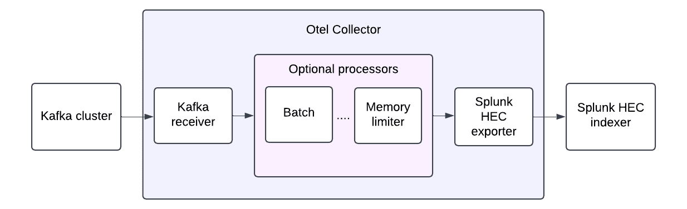

# Design

SOC4Kafka uses the OpenTelemetry Collector framework and includes three pipeline component types:

- Receivers
- Processors
- Exporters

### Receivers

The Kafka receiver fetches data from the Kafka cluster. See the [Kafka receiver documentation](https://github.com/open-telemetry/opentelemetry-collector-contrib/blob/main/receiver/kafkareceiver/README.md) for configuration details.

### Processors

Processors are optional pipeline components that transform data before export. Depending on their configuration, processors can filter or drop data. SOC4Kafka configures Splunk HTTP Event Collector (HEC) batching in the exporter `sending_queue.batch` instead of using a pipeline `batch` processor. More information about configuring processors is available [OpenTelemetry Collector processor documentation](https://github.com/open-telemetry/opentelemetry-collector/tree/main/processor#general-information).

### Exporters

Use the Splunk HEC exporter to send data to a Splunk index. See the [Splunk HEC exporter documentation](https://github.com/open-telemetry/opentelemetry-collector-contrib/blob/main/exporter/splunkhecexporter/README.md) for configuration details.
