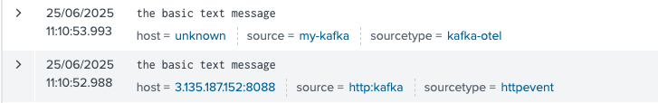
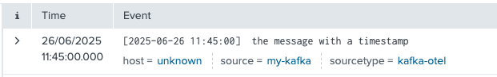
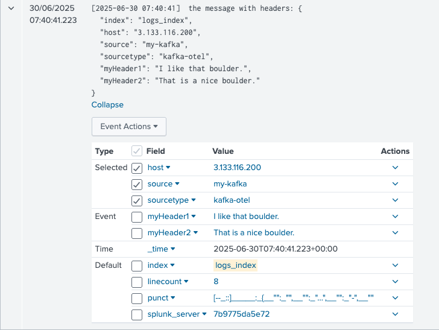
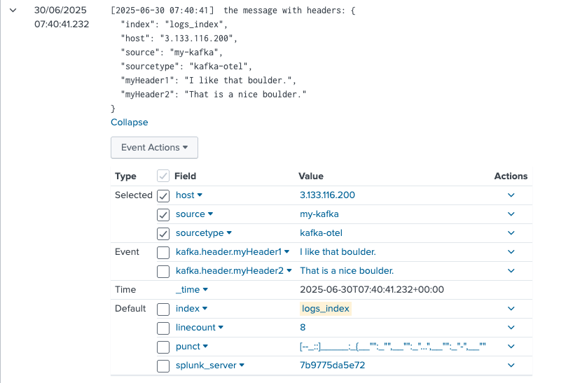
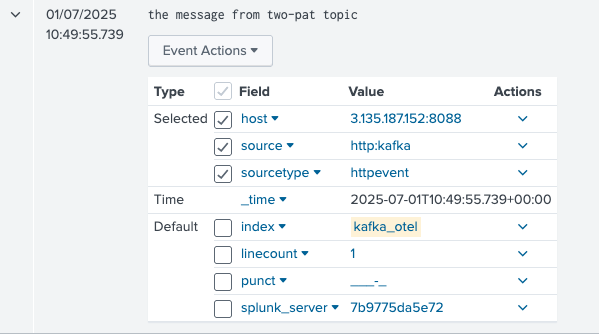
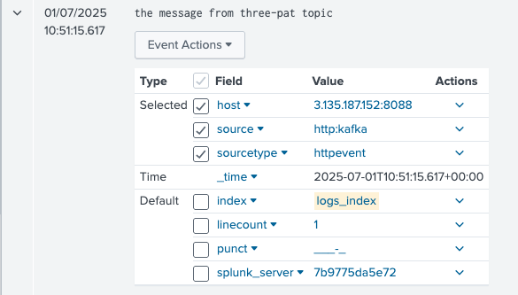
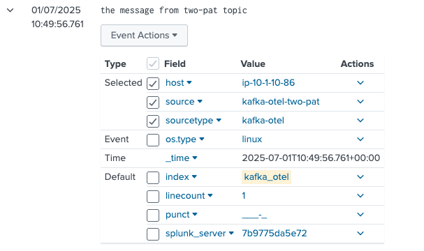
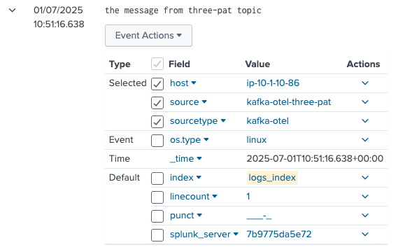
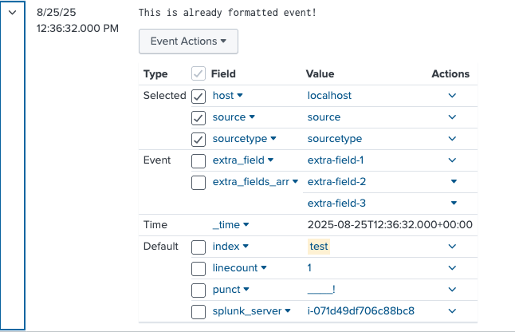

# Migration examples


Use these examples to migrate common Splunk Connect for Kafka configurations to the Collector for Kafka:

- Configure string messages from Kafka.
- Extract timestamps.
- Set the host automatically.
- Extract headers.
- Send data from multiple Kafka topics to multiple Splunk HEC endpoints.
- Send events that are already in HEC format.

---

## Configure string messages from Kafka

### Splunk Connect for Kafka configuration

```
curl localhost:8083/connectors -X POST -H "Content-Type: application/json" -d '{
    "name": "kafka-connect-splunk",
    "config": {
      "connector.class": "com.splunk.kafka.connect.SplunkSinkConnector",
      "tasks.max": "3",
      "splunk.indexes": "logs_index",
      "topics":"three-pat",
      "splunk.hec.uri": "https://splunk-hec-endpoint:8088",
      "splunk.hec.token": "your-splunk-hec-token"
    }
  }'
```

### Collector for Kafka configuration

```yaml
receivers:
  kafka:
    brokers: ["kafka-broker:9092"]
    logs:
      topics:
        - "three-pat"
      encoding: "text"


exporters:
  splunk_hec:
    token: "your-splunk-hec-token"
    endpoint: "https://splunk-hec-endpoint:8088/services/collector"
    source: my-kafka
    sourcetype: kafka-otel
    index: "logs_index"
    splunk_app_name: "soc4kafka"
    sending_queue:
      enabled: true
      num_consumers: 10
      queue_size: 10000
      block_on_overflow: true
      sizer: items
      batch:
        min_size: 1000

service:
  pipelines:
    logs:
      receivers: [kafka]
      exporters: [splunk_hec]
```



## Extract timestamps

By default, the Collector for Kafka assigns each event a timestamp based on when it collects the event. To use a timestamp from the log body, extract it with a transform processor. For example, consider this event:

```
[2025-06-26 11:45:00]  the message with a timestamp
```

```yaml
receivers:
  kafka:
    brokers: ["kafka-broker:9092"]
    logs:
      topics:
        - "three-pat"
      encoding: "text"

processors:
  transform:
    error_mode: ignore
    log_statements:
      - set(log.attributes["extracted_ts"], ExtractPatterns(log.body, "\\[(?P<timestamp>[0-9]{4}-[0-9]{2}-[0-9]{2} [0-9]{2}:[0-9]{2}:[0-9]{2})\\]"))
      - set(log.time, Time(log.attributes["extracted_ts"]["timestamp"], "%Y-%m-%d %H:%M:%S", "UTC"))
      - delete_key(log.attributes, "extracted_ts")

exporters:
  splunk_hec:
    token: "your-splunk-hec-token"
    endpoint: "https://splunk-hec-endpoint:8088/services/collector"
    source: my-kafka
    sourcetype: kafka-otel
    index: "logs_index"
    splunk_app_name: "soc4kafka"
    sending_queue:
      enabled: true
      num_consumers: 10
      queue_size: 10000
      block_on_overflow: true
      sizer: items
      batch:
        min_size: 1000

service:
  pipelines:
    logs:
      receivers: [kafka]
      processors: [transform]
      exporters: [splunk_hec]
```

The event appears in Splunk as follows:



## Set the host automatically

### Collector for Kafka configuration

By default, events produced by the Collector for Kafka might have the host field set to `unknown`. Configure the [resource detection processor](https://github.com/open-telemetry/opentelemetry-collector-contrib/tree/main/processor/resourcedetectionprocessor) to set another value.

The following example uses the processor to get the hostname of the machine that runs the Collector for Kafka. Depending on your requirements, you can instead get the host value from an environment variable or an API. For details, see the [resource detection processor documentation](https://github.com/open-telemetry/opentelemetry-collector-contrib/tree/main/processor/resourcedetectionprocessor).
```yaml
receivers:
  kafka:
    brokers: ["kafka-broker:9092"]
    logs:
      topics:
        - "three-pat"
      encoding: "text"

processors:
  resourcedetection:
    detectors: ["system"]
    system:
      hostname_sources: ["os"]

exporters:
  splunk_hec:
    token: "your-splunk-hec-token"
    endpoint: "https://splunk-hec-endpoint:8088/services/collector"
    source: my-kafka
    sourcetype: kafka-otel
    index: "logs_index"
    splunk_app_name: "soc4kafka"
    sending_queue:
      enabled: true
      num_consumers: 10
      queue_size: 10000
      block_on_overflow: true
      sizer: items
      batch:
        min_size: 1000

service:
  telemetry:
    logs:
      level: "debug"
  pipelines:
   logs:
     receivers: [kafka]
     processors: [resourcedetection]
     exporters: [splunk_hec]
```


## Extract headers

If incoming data includes additional headers, you can extract them as event attributes. The following examples extract these headers:

- index
- source
- sourcetype
- host
- myHeader1
- myHeader2

### Splunk Connect for Kafka configuration

```
curl localhost:8083/connectors -X POST -H "Content-Type: application/json" -d '{
    "name": "kafka-connect-splunk",
    "config": {
      "connector.class": "com.splunk.kafka.connect.SplunkSinkConnector",
      "tasks.max": "3",
      "splunk.indexes": "logs_index",
      "topics":"three-pat",
      "splunk.hec.uri": "https://splunk-hec-endpoint:8088",
      "splunk.hec.token": "your-splunk-hec-token",
      "splunk.header.index": "index",
      "splunk.header.source": "source",
      "splunk.header.sourcetype": "sourcetype",
      "splunk.header.host": "host",
      "splunk.header.custom": "myHeader1,myHeader2"
    }
  }'
```

### Collector for Kafka configuration

```yaml
receivers:
  kafka:
    brokers: ["kafka-broker:9092"]
    logs:
      topics:
        - "three-pat"
      encoding: "text"
    header_extraction:
      extract_headers: true
      headers: ["index", "source", "sourcetype", "host", "myHeader1", "myHeader2"]


exporters:
  splunk_hec:
    token: "your-splunk-hec-token"
    endpoint: "https://splunk-hec-endpoint:8088/services/collector"
    splunk_app_name: "soc4kafka"
    sending_queue:
      enabled: true
      num_consumers: 10
      queue_size: 10000
      block_on_overflow: true
      sizer: items
      batch:
        min_size: 1000
    otel_attrs_to_hec_metadata:
      index: kafka.header.index
      host: kafka.header.host
      source: kafka.header.source
      sourcetype: kafka.header.sourcetype

service:
  pipelines:
    logs:
      receivers: [kafka]
      exporters: [splunk_hec]
```

Events from Splunk Connect for Kafka appear in Splunk as follows:



Events from the Collector for Kafka appear in a similar format:



## Send data from multiple Kafka topics to multiple Splunk HEC endpoints

In Splunk Connect for Kafka, you can provide a list of topics and a corresponding list of indexes. Each topic's data is mapped to its respective index. For example, the first topic maps to the first index, the second topic maps to the second index, and so on.

In the Collector for Kafka, configure Kafka receivers and Splunk HEC exporters separately, then connect them in a pipeline. Each exporter can use different source and sourcetype values.

### Splunk Connect for Kafka configuration

```
curl localhost:8083/connectors -X POST -H "Content-Type: application/json" -d '{
    "name": "kafka-connect-splunk",
    "config": {
      "connector.class": "com.splunk.kafka.connect.SplunkSinkConnector",
      "tasks.max": "3",
      "splunk.indexes": "logs_index,kafka_otel",
      "topics":"three-pat,two-pat",
      "splunk.hec.uri": "https://splunk-hec-endpoint:8088",
      "splunk.hec.token": "your-splunk-hec-token",
    }
  }'
```

### Collector for Kafka configuration

```yaml
receivers:
  kafka/1:
    brokers: ["kafka-broker:9092"]
    logs:
      topics:
        - "three-pat"
      encoding: "text"

  kafka/2:
    brokers: ["kafka-broker:9092"]
    logs:
      topics:
        - "two-pat"
      encoding: "text"

processors:
  resourcedetection:
    detectors: ["system"]
    system:
      hostname_sources: ["os"]

exporters:
  splunk_hec/1:
    token: "your-splunk-hec-token"
    endpoint: "https://splunk-hec-endpoint:8088/services/collector"
    source: kafka-otel-three-pat
    sourcetype: kafka-otel
    index: "logs_index"
    splunk_app_name: "soc4kafka"
    sending_queue:
      enabled: true
      num_consumers: 10
      queue_size: 10000
      block_on_overflow: true
      sizer: items
      batch:
        min_size: 1000

  splunk_hec/2:
    token: "your-splunk-hec-token"
    endpoint: "https://splunk-hec-endpoint:8088/services/collector"
    source: kafka-otel-two-pat
    sourcetype: kafka-otel
    index: "kafka_otel"
    splunk_app_name: "soc4kafka"
    sending_queue:
      enabled: true
      num_consumers: 10
      queue_size: 10000
      block_on_overflow: true
      sizer: items
      batch:
        min_size: 1000

service:
  pipelines:
   logs/1:
     receivers: [kafka/1]
     processors: [resourcedetection]
     exporters: [splunk_hec/1]
   logs/2:
     receivers: [kafka/2]
     processors: [resourcedetection]
     exporters: [splunk_hec/2]
```

Events from Splunk Connect for Kafka appear as follows:




Events from the Collector for Kafka appear as follows:




The Collector for Kafka lets you configure a unique source and sourcetype for each topic. Use these values to filter and organize events in Splunk.

## Send events that are already in HEC format

To collect events that already use HEC format in Splunk Connect for Kafka, set `splunk.hec.json.event.formatted` to `true`.

### Splunk Connect for Kafka configuration

```
curl localhost:8083/connectors -X POST -H "Content-Type: application/json" -d' {
    "name": "splunk-prod-financial",
      "config": {
        "connector.class": "com.splunk.kafka.connect.SplunkSinkConnector",
        "tasks.max": "20",
        "topics": "t1",
        "splunk.hec.uri": "https://idx1:8088,https://idx2:8088,https://idx3:8088",
        "splunk.hec.token": "your-splunk-hec-token",
        "splunk.hec.json.event.formatted": "true",
        "key.converter": "org.apache.kafka.connect.storage.StringConverter",
        "key.converter.schemas.enable": "false",
        "value.converter": "org.apache.kafka.connect.storage.StringConverter",
        "value.converter.schemas.enable": "false"
 }
 }'
```

### Collector for Kafka configuration

To get the same result with the Collector for Kafka, set the `export_raw` option in the exporter configuration:

```yaml
receivers:
  kafka:
    brokers: ["kafka-broker:9092"]
    logs:
      topics:
        - "topic"
      encoding: "text"

exporters:
  splunk_hec:
    token: "your-splunk-hec-token"
    endpoint: "https://splunk-hec-endpoint:8088/services/collector"
    source: otel
    sourcetype: otel
    index: test
    splunk_app_name: "soc4kafka"
    sending_queue:
      enabled: true
      num_consumers: 10
      queue_size: 10000
      block_on_overflow: true
      sizer: items
      batch:
        min_size: 1000
    export_raw: true

service:
  pipelines:
    logs:
      receivers: [kafka]
      exporters: [splunk_hec]
```

The event uses this format:

```json
{
  "index":"test",
  "host":"localhost",
  "sourcetype":"sourcetype",
  "source":"source",
  "event":"This is already formatted event!",
  "fields":
  {
    "extra_field":"extra-field-1",
    "extra_fields_arr":
    [
      "extra-field-2",
      "extra-field-3"
    ]
  }
}
```

When configured correctly, the example message appears in Splunk search results as follows:


