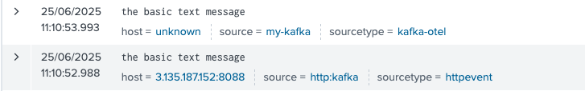
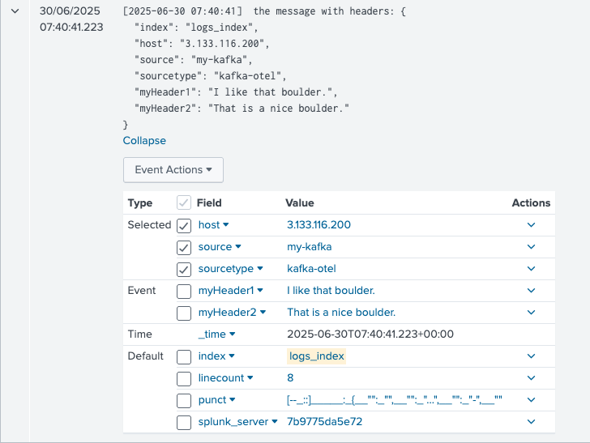
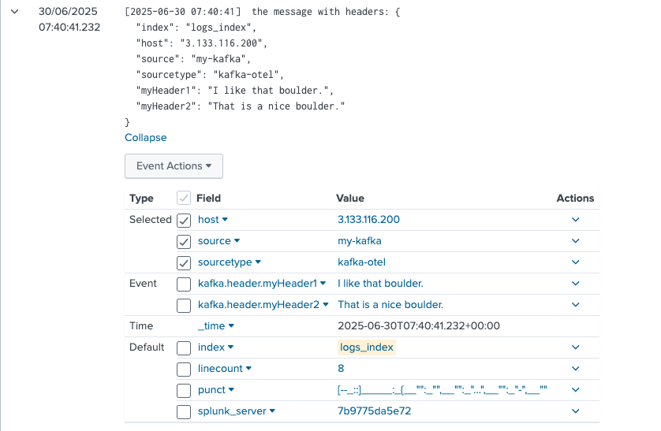
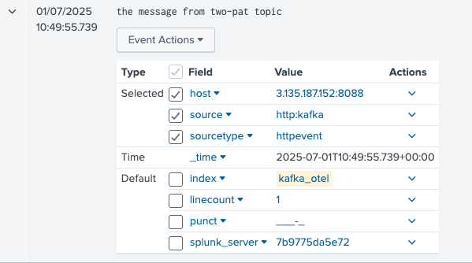
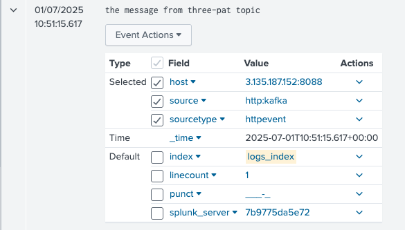
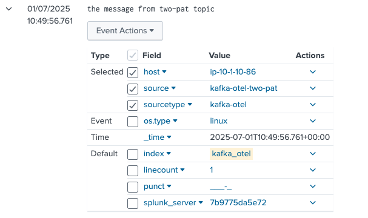
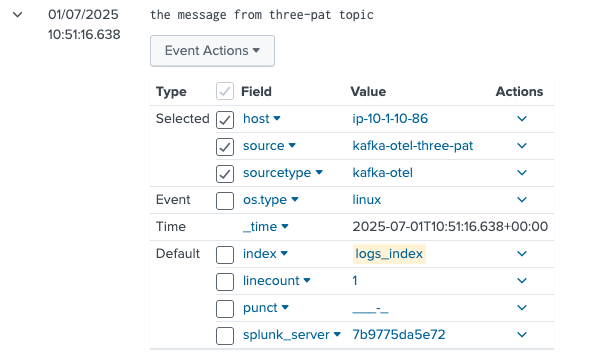
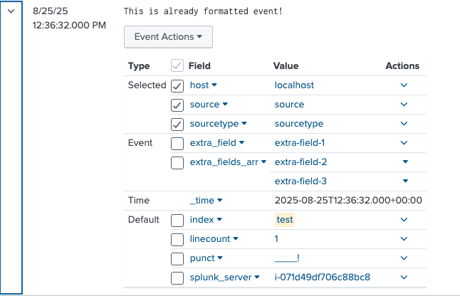

## Migration from Splunk Connector for Kafka

Naming: 
- SC4Kafka - the [Splunk Connect for Kafka](https://github.com/splunk/kafka-connect-splunk)
- SOC4Kafka - the Splunk OTel Connector for Kafka (the current project)

The biggest difference between SC4Kafka and SOC4Kafka is that:

| **Field**                  | **SC4Kafka**                                                                          | **SOC4Kafka**                                                                                                                                                                                                    |
|----------------------------|---------------------------------------------------------------------------------------|------------------------------------------------------------------------------------------------------------------------------------------------------------------------------------------------------------------|
| **Type**                   | Connector based on **Kafka Connect**, installed as an add-on for Kafka.               | Standalone product that works independently of Kafka.                                                                                                                                                            |
| **Message Retrieval**      | Retrieves events directly from Kafka.                                                 | Uses **REST calls** to Kafka (via the Kafka OpenTelemetry Receiver) to retrieve messages.                                                                                                                        |
| **Processing**             | Sends events directly to Splunk using the **Splunk HEC exporter**.                    | Processes messages internally and supports customization using **transform processors** before sending them to the **Splunk HEC exporter**.                                                                      |
| **Integration with Kafka** | Tightly integrated as part of the Kafka ecosystem.                                    | Can run independently and be deployed on an external server, separate from the Kafka cluster.                                                                                                                    |
| **Scaling**                | Scaling is managed using the `tasks.max` setting and supports multiple HEC endpoints. | Scaling is achieved by deploying multiple SOC4Kafka instances with the same `group_id`. Multiple HEC endpoints are not supported, but you can create multiple Splunk HEC exporters and add them to the pipeline. |


## Step by step SC4Kafka nad SOC4Kafka

In case of SC4Kafka the default settings about message format are set in `connect-distributed.properties` file. The key
and value converter (`org.apache.kafka.connect.json.JsonConverter` or `org.apache.kafka.connect.storage.StringConverter`)
is a part of Kafka's java ecosystem, in SOC4Kafka it can be handled by setting `receivers.kafka.encoding` to `json` or `text` depending on SC4Kafka configuration.

When migrating from SC4Kafka to SOC4Kafka following commands may be useful:

**List active connectors**

curl http://localhost:8083/connectors

**Get SC4Kafka connector info**

`curl http://localhost:8083/connectors/<CONNECTOR_NAME>`

**Get SC4Kafka connector config info**

`curl http://localhost:8083/connectors/<CONNECTOR_NAME>/config`

**Get SC4Kafka connector task info**

`curl http://localhost:8083/connectors/<CONNECTOR_NAME>/tasks`

### The basic config for Kafka string messages

#### SC4Kafka config

```
curl localhost:8083/connectors -X POST -H "Content-Type: application/json" -d '{
    "name": "kafka-connect-splunk",
    "config": {
      "connector.class": "com.splunk.kafka.connect.SplunkSinkConnector",
      "tasks.max": "3",
      "splunk.indexes": "logs_index",
      "topics":"three-pat",
      "splunk.hec.uri": "https://splunk-hec-endpoint:8088",
      "splunk.hec.token": "your-splunk-hec-token"
    }
  }'
```

#### SOC4Kafka config

```yaml
receivers:
 kafka:
   brokers: ["kafka-broker:9092"]
   topic: "three-pat"
   encoding: "text"

processors:
 batch:

exporters:
 splunk_hec:
   token: "your-splunk-hec-token"
   endpoint: "https://splunk-hec-endpoint:8088/services/collector"
   source: my-kafka
   sourcetype: kafka-otel
   index: "logs_index"

service:
 pipelines:
   logs:
     receivers: [kafka]
     processors: [batch]
     exporters: [splunk_hec]
```



Note: The timestamp behavior differs between the two connectors. SOC4Kafka assigns a timestamp to the event based on when it is indexed, whereas Splunk Connect for Kafka uses the timestamp from when the event was originally produced. Additionally messages from SOC4Kafka appear in Splunk first, as it forwards events to Splunk immediately. In contrast, Splunk Connect for Kafka processes and forwards events in batches, typically every configured number of seconds.

### Timestamp extraction

Even though by default kafka events from SOC4Kafka are marked with time of collecting data, if only we have a timestamp included as a part of the log body we can extract it. For example if the event is:

```
[2025-06-26 11:45:00]  the message with a timestamp
```

```yaml
receivers:
  kafka:
    brokers: ["kafka-broker:9092"]
    topic: "three-pat"
    encoding: "text"

processors:
  transform:
    error_mode: ignore
    log_statements:
      - set(log.attributes["extracted_ts"], ExtractPatterns(log.body, "\\[(?P<timestamp>[0-9]{4}-[0-9]{2}-[0-9]{2} [0-9]{2}:[0-9]{2}:[0-9]{2})\\]"))
      - set(log.time, Time(log.attributes["extracted_ts"]["timestamp"], "2006-01-02 15:04:05", "UTC"))
      - delete_key(log.attributes, "extracted_ts")
  batch:

exporters:
  splunk_hec:
    token: "your-splunk-hec-token"
    endpoint: "https://splunk-hec-endpoint:8088/services/collector"
    source: my-kafka
    sourcetype: kafka-otel
    index: "logs_index"

service:
  pipelines:
    logs:
      receivers: [kafka]
      processors: [batch, transform]
      exporters: [splunk_hec]
```

and the event in Splunk would be:


### Set host automatically

#### SOC4Kafka config

By default, events produced by SOC4Kafka may have the host field marked as `unknown`. This behavior can be adjusted using the [resource detection processor](https://github.com/open-telemetry/opentelemetry-collector-contrib/tree/main/processor/resourcedetectionprocessor).
The configuration example below demonstrates how to retrieve the hostname of the machine where SOC4Kafka is installed. Alternatively, the host value can be sourced from environmental variables or a specific API, depending on the client's requirements. The processor is flexible and can be tailored to meet specific use cases, as detailed in the [official documentation](https://github.com/open-telemetry/opentelemetry-collector-contrib/tree/main/processor/resourcedetectionprocessor\).
```yaml
receivers:
  kafka:
    brokers: ["kafka-broker:9092"]
    topic: "three-pat"
    encoding: "text"

processors:
  resourcedetection:
    detectors: ["system"]
    system:
      hostname_sources: ["os"]
  batch:

exporters:
  splunk_hec:
    token: "your-splunk-hec-token"
    endpoint: "https://splunk-hec-endpoint:8088/services/collector"
    source: my-kafka
    sourcetype: kafka-otel
    index: "logs_index"

service:
  telemetry:
    logs:
      level: "debug"
  pipelines:
   logs:
     receivers: [kafka]
     processors: [batch, resourcedetection]
     exporters: [splunk_hec]
```


### Extract headers

If there are additional headers present in the incoming data, they can be extracted and added as event attributes. This allows for greater flexibility in customizing event metadata.
In the following examples, we will extract the following headers and include them as event attributes:
- index
- source
- sourcetype
- host
- myHeader1
- myHeader2

#### SC4Kafka config

```
curl localhost:8083/connectors -X POST -H "Content-Type: application/json" -d '{
    "name": "kafka-connect-splunk",
    "config": {
      "connector.class": "com.splunk.kafka.connect.SplunkSinkConnector",
      "tasks.max": "3",
      "splunk.indexes": "logs_index",
      "topics":"three-pat",
      "splunk.hec.uri": "https://splunk-hec-endpoint:8088",
      "splunk.hec.token": "your-splunk-hec-token",
      "splunk.header.index": "index",
      "splunk.header.source": "source",
      "splunk.header.sourcetype": "sourcetype",
      "splunk.header.host": "host",
      "splunk.header.custom": "myHeader1,myHeader2"
    }
  }'
```

#### SOC4Kafka config

```yaml
receivers:
 kafka:
   brokers: ["kafka-broker:9092"]
   topic: "three-pat"
   encoding: "text"
   header_extraction:
     extract_headers: true
     headers: ["index", "source", "sourcetype", "host", "myHeader1", "myHeader2"]

processors:
 batch:

exporters:
 splunk_hec:
   token: "your-splunk-hec-token"
   endpoint: "https://splunk-hec-endpoint:8088/services/collector"
   otel_attrs_to_hec_metadata:
     index: kafka.header.index
     host: kafka.header.host
     source: kafka.header.source
     sourcetype: kafka.header.sourcetype

service:
 pipelines:
   logs:
     receivers: [kafka]
     processors: [batch]
     exporters: [splunk_hec]
```

This is how events generated by SC4Kafka are displayed in Splunk:



Similarly, events generated by SOC4Kafka are presented in a comparable format:



### Send data from multiple kafka topics to multiple Splunk HEC endpoints

In SC4Kafka, you can provide a list of topics along with a corresponding list of indexes, where each topic's data is mapped to its respective index (e.g., the first topic maps to the first index, the second topic to the second index, and so on).


In SOC4Kafka, the configuration is more flexible and modular. You define Kafka receivers and Splunk HEC exporters separately and connect them using a pipeline structure. Additionally, you can configure different source and sourcetype values directly within the settings of each Splunk HEC exporter, enabling greater customization for data routing and metadata assignment.

#### SC4Kafka config

```
curl localhost:8083/connectors -X POST -H "Content-Type: application/json" -d '{
    "name": "kafka-connect-splunk",
    "config": {
      "connector.class": "com.splunk.kafka.connect.SplunkSinkConnector",
      "tasks.max": "3",
      "splunk.indexes": "logs_index,kafka_otel",
      "topics":"three-pat,two-pat",
      "splunk.hec.uri": "https://splunk-hec-endpoint:8088",
      "splunk.hec.token": "your-splunk-hec-token",
    }
  }'
```

#### SOC4Kafka

```yaml
receivers:
  kafka/1:
    brokers: ["kafka-broker:9092"]
    topic: "three-pat"
    encoding: "text"

  kafka/2:
    brokers: ["kafka-broker:9092"]
    topic: "two-pat"
    encoding: "text"

processors:
  resourcedetection:
    detectors: ["system"]
    system:
      hostname_sources: ["os"]
  batch:

exporters:
  splunk_hec/1:
    token: "your-splunk-hec-token"
    endpoint: "https://splunk-hec-endpoint:8088/services/collector"
    source: kafka-otel-three-pat
    sourcetype: kafka-otel
    index: "logs_index"

  splunk_hec/2:
    token: "your-splunk-hec-token"
    endpoint: "https://splunk-hec-endpoint:8088/services/collector"
    source: kafka-otel-two-pat
    sourcetype: kafka-otel
    index: "kafka_otel"

service:
  pipelines:
   logs/1:
     receivers: [kafka/1]
     processors: [batch, resourcedetection]
     exporters: [splunk_hec/1]
   logs/2:
     receivers: [kafka/2]
     processors: [batch, resourcedetection]
     exporters: [splunk_hec/2]
```

The events generated by SC4Kafka are:




While the events from SOC4Kafka are:




Mind that SOC4Kafka allows you to configure a unique sourcetype and source for each individual topic. This flexibility simplifies filtering and organizing data within Splunk, ensuring better control over your event categorization and search results.

### Sending events that are already in HEC format

In SC4Kafka you can collect events that are already formatted in HEC format, by setting `splunk.hec.json.event.formatted` option to `true`.

#### SC4Kafka config

```
curl localhost:8083/connectors -X POST -H "Content-Type: application/json" -d' {
    "name": "splunk-prod-financial",
      "config": {
        "connector.class": "com.splunk.kafka.connect.SplunkSinkConnector",
        "tasks.max": "20",
        "topics": "t1",
        "splunk.hec.uri": "https://idx1:8088,https://idx2:8088,https://idx3:8088",
        "splunk.hec.token": "your-splunk-hec-token",
        "splunk.hec.json.event.formatted": "true",
        "key.converter": "org.apache.kafka.connect.storage.StringConverter",
        "key.converter.schemas.enable": "false",
        "value.converter": "org.apache.kafka.connect.storage.StringConverter",
        "value.converter.schemas.enable": "false"
 }
 }'
```

#### SOC4Kafka

To achieve the same result in SOC4Kafka use `export_raw` option in exporter configuration:

```yaml
receivers:
 kafka:
   brokers: ["kafka-broker:9092"]
   topic: "topic"
   encoding: "text"

exporters:
  splunk_hec:
    token: "your-splunk-hec-token"
    endpoint: "https://splunk-hec-endpoint:8088/services/collector"
    source: otel
    sourcetype: otel
    index: test
    export_raw: true

service:
  pipelines:
    logs:
      receivers: [kafka]
      exporters: [splunk_hec]
```

Example of event in this format:

```json
{
  "index":"test",
  "host":"localhost",
  "sourcetype":"sourcetype",
  "source":"source",
  "event":"This is already formatted event!",
  "fields":
  {
    "extra_field":"extra-field-1",
    "extra_fields_arr":
    [
      "extra-field-2",
      "extra-field-3"
    ]
  }
}
```

The example message appears like this in Splunk search results when properly configured:



### Additional migration config values

The values in SCK4Kafka do not map directly to SOC4Kafka. However, for reference, [this table](migration_config_values.md) provides a comparison of the corresponding properties in both.