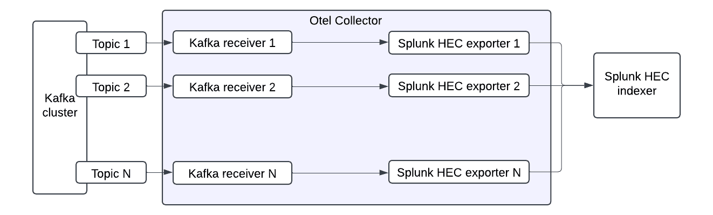

## Collecting events from multiple topics

The configuration is similar to the default one described [here](../README.md#create-a-minimal-config-template), with the addition of multiple receivers - one for each topic you want to monitor. Thanks to the flexibility of the OpenTelemetry Collector, the setup can be tailored to meet specific requirements. This modular approach allows you to treat the components as building blocks, enabling you to create a pipeline that aligns perfectly with your use case. Depending on your needs, you can either use a single exporter for all receivers or configure a separate exporter for each receiver.



### Example config

```yaml
receivers:
  kafka/example_topic_a:
    brokers: ["localhost:9092"]
    logs:
      topics: 
        - "example-topic-a-1"
        - "example-topic-a-2"
      encoding: "text"

  kafka/example_topic_b:
    brokers: ["localhost:9092"]
    logs:
      topics: 
        - "example-topic-b-1"
      encoding: "text"
processors:
 batch:

exporters:
  splunk_hec/a:
    token: "your-splunk-hec-token"
    endpoint: "https://splunk-hec-endpoint:8088/services/collector"
    source: my-kafka
    sourcetype: kafka-otel
    index: kafka_otel_index_a
    splunk_app_name: "soc4kafka"
      
  splunk_hec/b:
    token: "your-splunk-hec-token"
    endpoint: "https://splunk-hec-endpoint:8088/services/collector"
    source: my-kafka
    sourcetype: kafka-otel
    index: kafka_otel_index_b
    splunk_app_name: "soc4kafka"

service:
  pipelines:
    logs/a:
      receivers: [kafka/example_topic_a]
      processors: [batch]
      exporters: [splunk_hec/a]
    logs/b:
     receivers: [kafka/example_topic_b]
     processors: [batch]
     exporters: [splunk_hec/b]
```