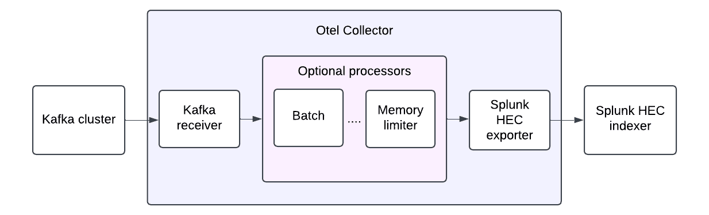

## Design

The SOC4Kafka connector is designed using the OpenTelemetry Collector framework and is composed of various classes of pipeline components. The key components of the Kafka OpenTelemetry (OTel) connector include:
- Receivers
- Processors
- Exporters

### Receivers

The Kafka receiver is responsible for fetching data from the Kafka cluster. Detailed configuration instructions for this receiver can be found [here](https://github.com/open-telemetry/opentelemetry-collector-contrib/blob/main/receiver/kafkareceiver/README.md).

### Processors

Processors are optional components within the data pipeline that transform data before it is exported. Each processor performs specific actions based on its configuration, such as batching, filtering, or dropping data, among others. More information about configuring processors is available [here](https://github.com/open-telemetry/opentelemetry-collector/tree/main/processor#general-information).

### Exporters

The Splunk HEC exporter is used to send data to a Splunk HEC index. Detailed configuration guidelines for this exporter can be found [here](https://github.com/open-telemetry/opentelemetry-collector-contrib/blob/main/exporter/splunkhecexporter/README.md).

