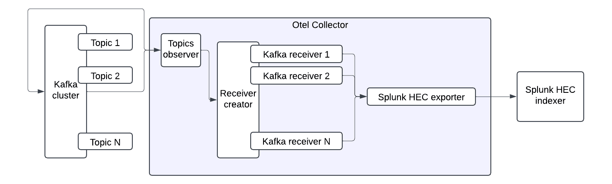

## Subscribing to topics using regex

To subscribe to topics using regex, the `kafkatopics_observer` extension must be used in combination with the `receiver_creator` receiver. You can find the detailed documentation for the [kafkatopics_observer](https://github.com/open-telemetry/opentelemetry-collector-contrib/tree/main/extension/observer/kafkatopicsobserver) extension and the [receiver_creator](https://github.com/open-telemetry/opentelemetry-collector-contrib/tree/main/receiver/receivercreator) receiver at their respective links.


It is important to ensure that the brokers list, protocol version, and authorization settings are consistent across both the `kafkatopics_observer` and the `receiver_creator`. The `kafkatopics_observer` will continuously monitor and update the list of topics that match the specified regex pattern. Meanwhile, the `receiver_creator` will dynamically create or delete Kafka receivers, with each receiver subscribing to a unique topic.


Additionally, the endpoint expression defined in the topic variable within the `receiver_creator` will be dynamically updated to reflect the discovered topic name. This setup allows for efficient and automated management of topic subscriptions.



### Example config

```yaml
extensions:
 kafkatopics_observer:
   brokers: ["localhost:9092"]
   protocol_version: <Kafka Version>
   topic_regex: "^new_topic[0-9]$"
   topics_sync_interval: 5s

receivers:
 receiver_creator:
   watch_observers: [kafkatopics_observer]
   receivers:
     kafka:
       rule: type == "kafka.topics"
       config:
         protocol_version: <Kafka Version>
         topic: '`endpoint`'
         encoding: text
         brokers: ["localhost:9092"]

processors:
 batch:

exporters:
 splunk_hec:
   token: "your-splunk-hec-token"
   endpoint: "https://splunk-hec-endpoint:8088/services/collector"
   source: my-kafka
   sourcetype: kafka-otel
   index: kafka_otel

service:
 extensions: [kafkatopics_observer]
 pipelines:
   logs:
     receivers: [receiver_creator]
     processors: [batch]
     exporters: [splunk_hec]
```

Note: replace `<Kafka Version>` with a version of Kafka you're using.