# SOC4Kafka health dashboard

Use the SOC4Kafka dashboard to monitor Kafka metrics. It combines data from three sources to show the environment’s performance and health.

## Overview

The dashboard consists of seven tabs, each dedicated to monitoring key aspects of the system. Each tab includes its own graphs, gauges, and inputs for selecting appropriate data. Additionally, there are three common input buttons for all tabs:

- **Time Range**: Select the date and time range for the metrics. Some gauges, such as Active Collectors, always show the latest information.
- **Log Indexes**: Select both the event and metrics indexes to display all dashboard features.
- **Time Span**: Choose the interval for aggregating data in time-based graphs.

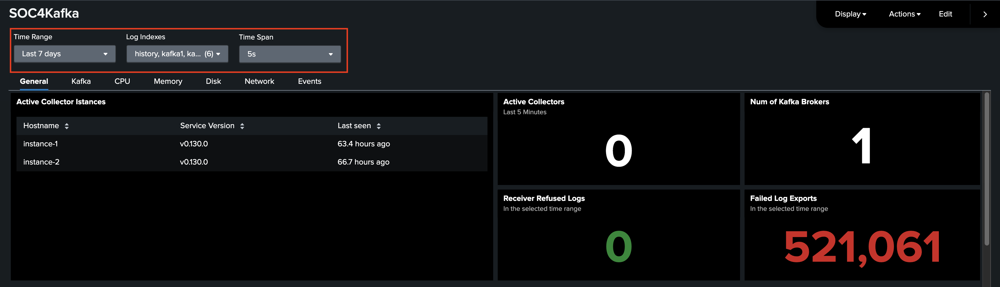

### General

The **General** tab shows SOC4Kafka health, including a table of active collector instances and a gauge for active Kafka brokers. The Active Collectors gauge shows data from the last 5 minutes.

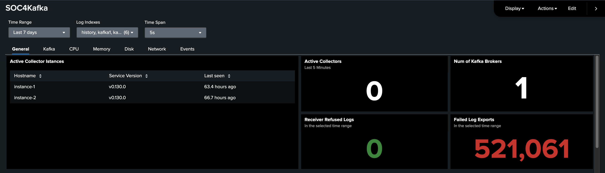

Graphs show the number of messages received and exported by each instance. They aggregate values across the instance’s receivers and exporters. Select an instance to view more detail.

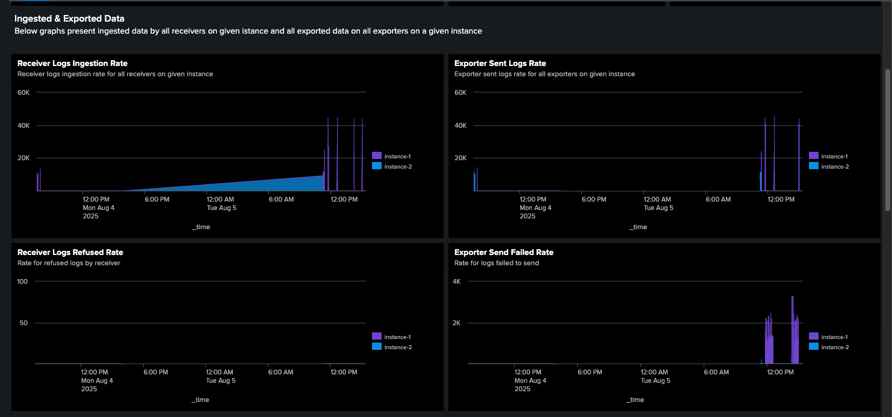
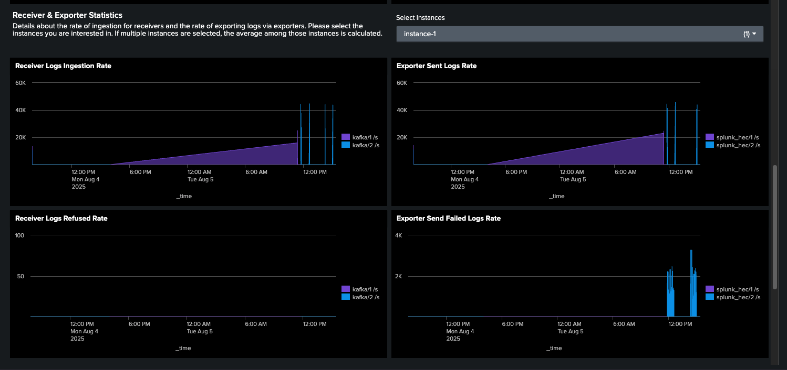

The tab also shows information about the exporter queue.

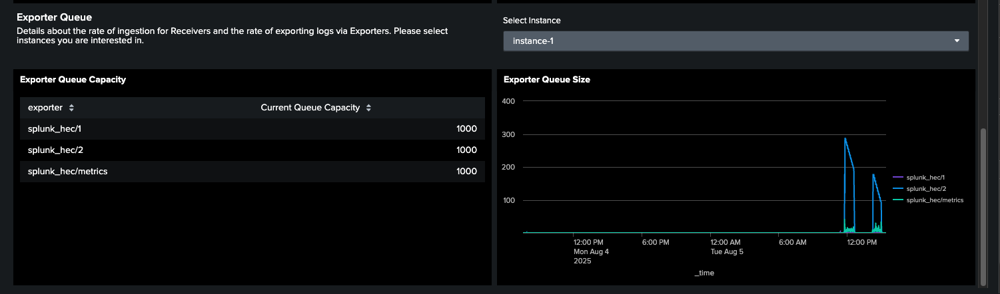

### Kafka

The **Kafka** tab shows topics, topic replicas, consumer groups, Kafka offsets, and consumer lag.

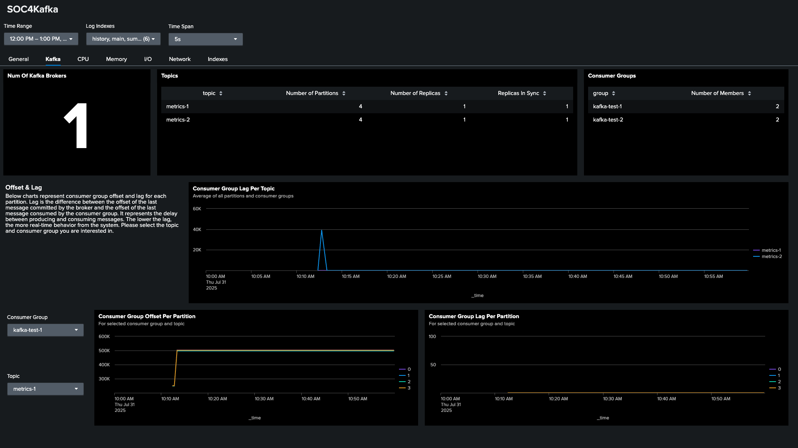

For the last two charts, select the appropriate topic for each consumer group. Otherwise, the charts show no results.

### CPU, memory, disk, network

The next four tabs present data associated with the system metrics of machines running SOC4Kafka instances.

The **CPU** tab shows the number of logical CPU cores, process CPU utilization, and system CPU utilization. You can choose which task types to include in the statistics. By default, the dashboard includes system and CPU modes.

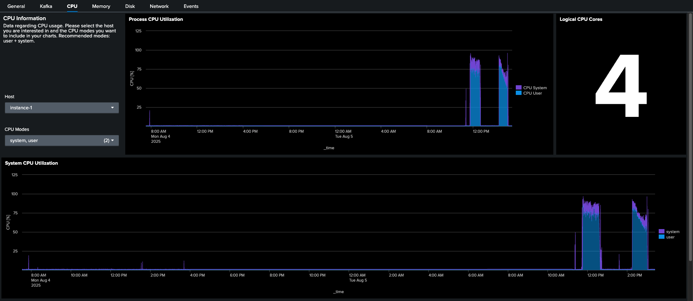
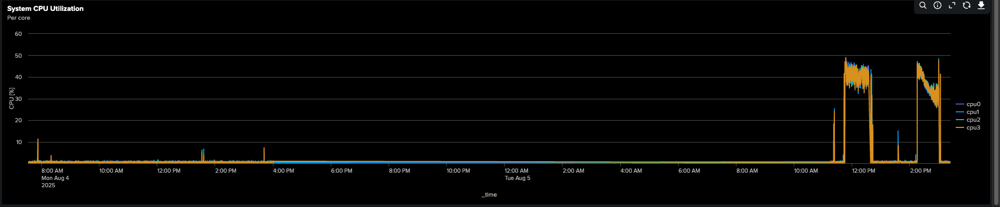

The **Memory** tab shows system memory utilization, total available memory, and system and memory usage. You can choose which memory metrics to include in the graphs.

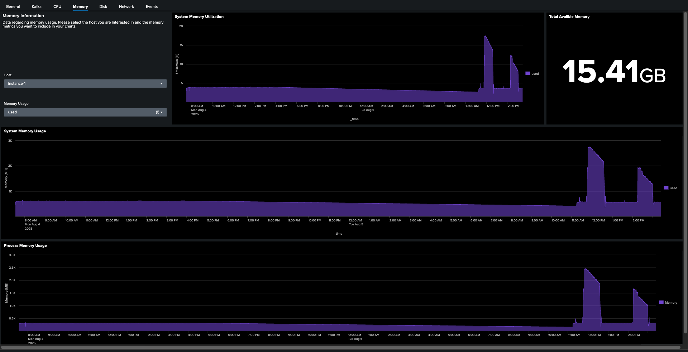

The **Disk** tab shows disk usage. The filesystem utilization gauge shows the selected filesystem’s space usage. Select a filesystem from the drop-down list.

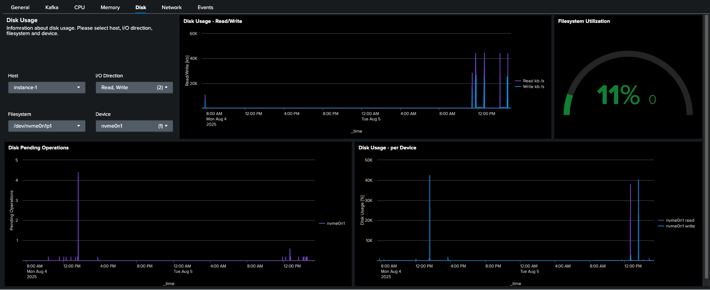

The **Network** tab shows network traffic.

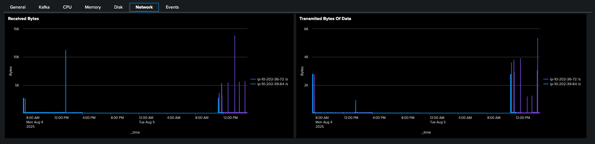

### Events

The **Events** tab collects data associated with events received by the Splunk instance. Use the drop-down lists to filter events by hostname, source, and sourcetype and view the distribution of those values among indexed events. In environments with high data ingress, this tab might take longer to load.

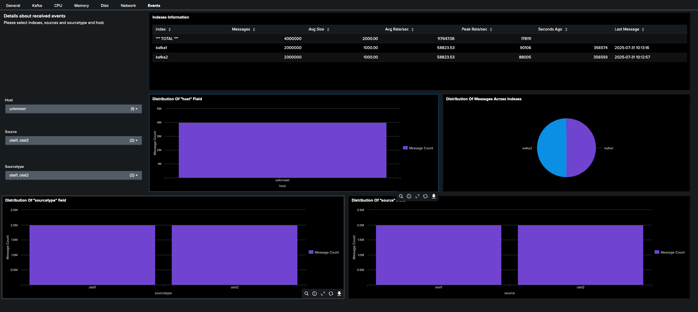

## Install the dashboard

### Configuration for SOC4Kafka

The dashboard uses three telemetry data sources:

1. **hostmetrics** receiver [documentation](https://github.com/open-telemetry/opentelemetry-collector-contrib/tree/main/receiver/hostmetricsreceiver)
2. **kafkametrics** receiver [documentation](https://github.com/open-telemetry/opentelemetry-collector-contrib/tree/main/receiver/kafkametricsreceiver)
3. **Internal Telemetry** of OpenTelemetry Collector [documentation](https://opentelemetry.io/docs/collector/internal-telemetry/#lists-of-internal-metrics)

Configure all three sources for the dashboard to display its data.

1. Configure receivers:

```yaml
receivers:
  prometheus:
    config:
      scrape_configs:
        - job_name: 'otel-collector'
          scrape_interval: 1s
          static_configs:
            - targets: ['0.0.0.0:8888']
  kafkametrics:
    brokers: [<kafka-broker-address>:<port>]
    protocol_version: 2.0.0
    scrapers:
      - brokers
      - topics
      - consumers
  hostmetrics:
    collection_interval: 1s
    scrapers:
      cpu:
        metrics:
          system.cpu.utilization:
            enabled: true
          system.cpu.logical.count:
            enabled: true
      memory:
        metrics:
          system.memory.utilization:
            enabled: true
          system.memory.limit:
            enabled: true
      process:
        mute_process_all_errors: true
        include:
          names: [ "otelcol_linux_amd64" ] # name of the collector binary
          match_type: "regexp"
        metrics:
          process.memory.utilization:
            enabled: true
          process.cpu.utilization:
            enabled: true
      filesystem:
        metrics:
          system.filesystem.utilization:
            enabled: true
      disk:
        metrics:
          system.disk.io:
            enabled: true
      network:
```

2. Add **resourcedetection** to allow filtering by host

```yaml
processors:
  resourcedetection:
    detectors: ["system"]
    system:
      hostname_sources: ["os"]
```

3. Add exporter for metrics

```yaml
exporters:
  splunk_hec/metrics:
    token: <hec-token>
    endpoint: http://<splunk-address>:8088/services/collector
    source: <source>
    sourcetype: <sourcetype>
    index: <metrics-index>
    splunk_app_name: "soc4kafka"
    sending_queue:
      enabled: true
      num_consumers: 10
      queue_size: 10000
      block_on_overflow: true
      sizer: items
      batch:
        min_size: 1000
```

Create a metrics-type index:

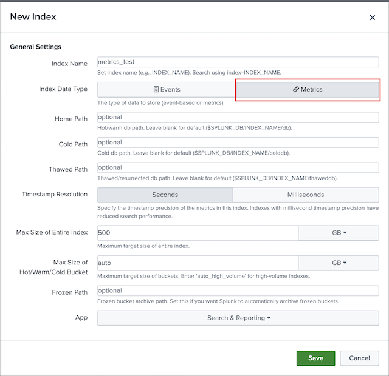

4. Create **telemetry** service
```yaml
service:
  telemetry:
    metrics:
      level: "detailed"
      readers:
        - pull:
            exporter:
              prometheus:
                host: '0.0.0.0'
                port: 8888
```

5. Add pipeline for metrics

```yaml
service:
  pipelines:
    metrics:
      receivers: [ prometheus, hostmetrics, kafkametrics ]
      processors: [resourcedetection]
      exporters: [ splunk_hec/metrics ]
```

   Configure other receivers & exporters as normal.

### Create dashboard in Splunk

!!! note

    This dashboard is available only for Splunk version 9.4.0 and higher

1. In Splunk, open **Search & Reporting -> Dashboards**
2. Click on **Create New Dashboard** and create a new dashboard. Make sure to choose **Dashboard Studio** and **Grid** options.
3. In the edit view, go to the **source code editor** and replace the initial configuration with this [JSON file](../../dashboards/SOC4Kafka-health-dashboard.json)

4. Save your changes