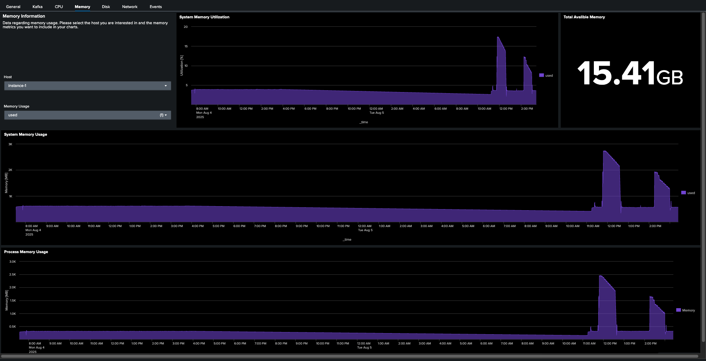

# SOC4Kafka Health Dashboard

The SOC4Kafka dashboard is a preconfigured Splunk dashboard that allows users to monitor key metrics in their Kafka environment. It collects data from all three sources to provide a comprehensive overview of the performance and health of the environment.

## Overview

The dashboard consists of seven tabs, each dedicated to monitoring key aspects of the system. Each tab includes its own graphs, gauges, and inputs for selecting appropriate data. Additionally, there are three common input buttons for all tabs:

- **Time Range**: Used to set the date-time range for the metrics. Note that some gauges always display the latest information, such as the Active Collectors Gauge.
- **Log Indexes**: Used to select the indexes you are interested in. Note that for all dashboard features to work, you need to select both indexes used for collecting events and metrics.
- **Time Span**: All data will be aggregated using an appropriate function within this span, also known as the resolution of time-based graphs.


### General

The **General** tab shows all the most important information regarding SOC4Kafka health. A table with information about active instances of collectors and a gauge representing the number of active Kafka brokers is presented. Note that the Active Collector gauge always displays information from the last 5 minutes.


Further, a graph of received and exported messages for each instance is presented. These graphs aggregate values across all receivers/exporters on a given instance. Below this section, you can select an instance you are interested in to see a more detailed view.


Lastly, information about the exporter queue is displayed.


### Kafka

This tab represents all the data directly related to the Kafka instance, such as the list of topics, the number of topics and replicas for each topic, and the list of consumer groups. Charts representing Kafka offset and lag are also presented.


Make sure that for the last two charts, the appropriate topic is selected for each consumer group; otherwise, the graph will show no results.

### CPU, Memory, Disk, Network

The next four tabs present data associated with the system metrics of machines running SOCK4Kafka instances.

The first one, **CPU**, includes: the number of CPU logical cores, process CPU utilization, and system CPU utilization. Please note that you can choose which types of tasks should be included in data statistics. The default is system and CPU mode, but if you are interested in other tasks, you can select them here.


The **Memory** tab includes data like: system memory utilization, total available memory, system, and memory usage. Similar to the CPU tab, you can choose different memory metrics to be included in the graphs.



The **Disk** tab presents information about disk usage. Please note that the filesystem utilization gauge represents the usage of space of a selected filesystem. The filesystem can be selected in the dropdown on the left.


Lastly, **Network** shows information about network traffic.


### Events

The **Events** tab collects data associated with events received by the Splunk instance. Using dropdowns on the left, you can filter events by hostname, source, and sourcetype. You can also see the distribution of these values among indexed events. Please note that in environments with large data ingress, collecting metrics for this tab may take more time than for others.


## Install the Dashboard

### Configuration for SOC4Kafka

To provide you with all the most important data, we are using three distinct sources of telemetry data:

1. **hostmetrics** receiver [documentation](https://github.com/open-telemetry/opentelemetry-collector-contrib/tree/main/receiver/hostmetricsreceiver)
2. **kafkametrics** receiver [documentation](https://github.com/open-telemetry/opentelemetry-collector-contrib/tree/main/receiver/kafkametricsreceiver)
3. **Internal Telemetry** of Open Telemetry Collector [documentation](https://opentelemetry.io/docs/collector/internal-telemetry/#lists-of-internal-metrics)

All of these must be configured to ensure the correct functioning of the dashboard.

1. Configure receivers:

```yaml
receivers:
  prometheus:
    config:
      scrape_configs:
        - job_name: 'otel-collector'
          scrape_interval: 1s
          static_configs:
            - targets: ['0.0.0.0:8888']
  kafkametrics:
    brokers: [<kafka-broker-address>:<port>]
    protocol_version: 2.0.0
    scrapers:
      - brokers
      - topics
      - consumers
  hostmetrics:
    collection_interval: 1s
    scrapers:
      cpu:
        metrics:
          system.cpu.utilization:
            enabled: true
          system.cpu.logical.count:
            enabled: true
      memory:
        metrics:
          system.memory.utilization:
            enabled: true
          system.memory.limit:
            enabled: true
      process:
        mute_process_all_errors: true
        include:
          names: [ "otelcol_linux_amd64" ] # name of the collector binary
          match_type: "regexp"
        metrics:
          process.memory.utilization:
            enabled: true
          process.cpu.utilization:
            enabled: true
      filesystem:
        metrics:
          system.filesystem.utilization:
            enabled: true
      disk:
        metrics:
          system.disk.io:
            enabled: true
      network:
```

2. Add **resourcedetection** to allow filtering by host

```yaml
processors:
  resourcedetection:
    detectors: ["system"]
    system:
      hostname_sources: ["os"]
```

3. Add exporter for metrics

```yaml
exporters:
  splunk_hec/metrics:
    token: <hec-token>
    endpoint: http://<splunk-address>:8088/services/collector
    source: <source>
    sourcetype: <sourcetype>
    index: <metrics-index>
    splunk_app_name: "soc4kafka"
    splunk_app_version: 0.145.0
```

Make sure you've created a metric type index:


4. Create **telemetry** service
```yaml
service:
  telemetry:
    metrics:
      level: "detailed"
      readers:
        - pull:
            exporter:
              prometheus:
                host: '0.0.0.0'
                port: 8888
```

5. Add pipeline for metrics

```yaml
service:
  pipelines:
    metrics:
      receivers: [ prometheus, hostmetrics, kafkametrics ]
      processors: [resourcedetection]
      exporters: [ splunk_hec/metrics ]
```

   Configure other receivers & exporters as normal.

### Create Dashboard in Splunk

**NOTE:** This dashboard is available only for Splunk version 9.4.0 and higher

1. In Splunk, open **Search & Reporting -> Dashboards**
2. Click on **Create New Dashboard** and create a new dashboard. Make sure to choose **Dashboard Studio** and **Grid** options.
3. In the edit view, go to the **source code editor** and replace the initial configuration with this [JSON file](../dashboards/SOC4Kafka-health-dashboard.json)

4. Save your changes